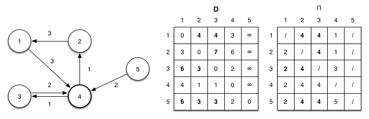

# Floyd-Warshall

> The Floyd–Warshall algorithm typically only provides the lengths of the paths between all pairs of vertices. With simple modifications, it is possible to create a method to reconstruct the actual path between any two endpoint vertices. While one may be inclined to store the actual path from each vertex to each other vertex, this is not necessary, and in fact, is very costly in terms of memory. - wiki

